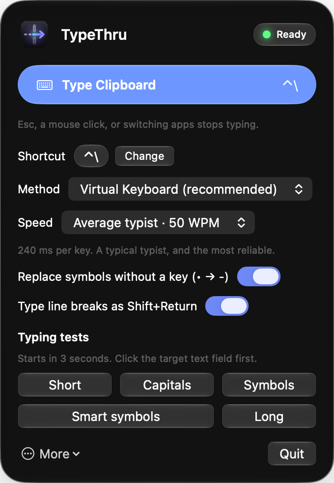

<p align="center">
  <picture>
    <source media="(prefers-color-scheme: dark)" srcset="docs/logo-dark.png">
    
  </picture>
</p>

<p align="center">
  Type your clipboard into VDI and remote desktops where paste does not work.<br>
  <a href="https://github.com/sayre4ux/TypeThru/releases"><b>Download for macOS</b></a>
</p>

<p align="center">
  
</p>

## Features

- **Real key presses** through a virtual keyboard, so remote sessions accept them.
- **Five speeds**, from an average typist to an unrealistic 600 words per minute.
- **Smart symbols**: bullets, curly quotes, and dashes are typed as plain keys.
- **New lines, not sends**: line breaks are typed as Shift+Return.
- **Stops instantly** when you press Esc, click, or switch apps.
- **Your shortcut**: Control+\\ by default, or choose your own.

## Install

Requires macOS 13 or later.

1. Download the `.dmg` from [Releases](https://github.com/sayre4ux/TypeThru/releases).
2. Drag **TypeThru** into **Applications**, then open it.
3. If macOS says it cannot verify TypeThru, go to **System Settings › Privacy & Security**
   and choose **Open Anyway**.
4. Allow TypeThru in **Accessibility** when asked.
5. Choose **Set Up** and enter your password to install the virtual keyboard.

Upgrading from KeyTyper? Delete the old app and run **Set Up** once.

## Use

1. Copy text on your Mac.
2. Click a text field in the remote session.
3. Press **Control+\\** (or your own shortcut).

Click the menu bar icon to change the shortcut or speed, run a typing test, or turn options
off. Control alone is the safest shortcut, because other modifier keys also reach the remote
session.

## Troubleshooting

- **Nothing appears:** click the remote text field first, then try again.
- **Characters are missing:** choose a slower speed.
- **Typing does not start after an update:** turn TypeThru off and on in **Accessibility**.
- **Set Up keeps asking:** allow the Karabiner driver in **System Settings**.

## Privacy

- TypeThru sends key presses. It never records what you type.
- No event tap and no Input Monitoring. It only checks whether Esc, the modifier keys, the
  shortcut key, or a mouse button is held down, and while typing, which app and window are in
  front.
- When you change the shortcut, the panel reads only the keys you press in it, until you
  choose one.
- The clipboard is read only when you ask it to type, and is never saved or logged.
- No network access.
- The virtual keyboard helper runs as root because the driver requires it. It accepts key
  presses only from your Mac account and cannot read keyboard input. Other apps running as you
  could also use it, so uninstall TypeThru when you no longer need it.
- Setup and uninstall run as administrator only after you enter your password. Setup checks
  the driver's signature and never replaces a different driver version.

Report security issues through GitHub private vulnerability reporting.

## Uninstall

Click the menu bar icon, choose **More › Uninstall TypeThru…**, then move the app to the Trash.

## Build from source

```sh
./test.sh && ./build.sh
```

Needs the Xcode Command Line Tools. See [AGENTS.md](AGENTS.md) for how it works, signing,
and project rules.

## License

MIT. The virtual keyboard driver,
[Karabiner-DriverKit-VirtualHIDDevice](https://github.com/pqrs-org/Karabiner-DriverKit-VirtualHIDDevice),
is by pqrs.org under the Unlicense.
