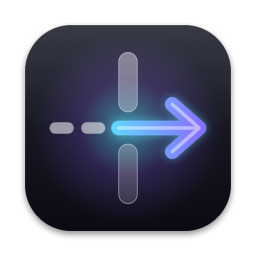
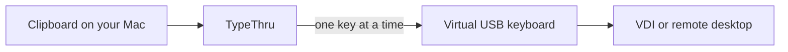

<p align="center">
  
</p>

<h1 align="center">TypeThru</h1>

<p align="center">
  <b>Type your clipboard through to any remote desktop.</b><br>
  For VDI and remote desktop sessions where paste does not work.
</p>

<p align="center">
  <a href="https://github.com/sayre4ux/TypeThru/releases"></a>
  
  
  <a href="LICENSE"></a>
</p>

<p align="center">
  <a href="https://github.com/sayre4ux/TypeThru/releases"><b>Download for macOS</b></a>
  &nbsp;·&nbsp; <a href="#install">Install</a>
  &nbsp;·&nbsp; <a href="#use">Use</a>
  &nbsp;·&nbsp; <a href="#privacy-and-security">Privacy</a>
</p>

<p align="center">
  
</p>

---

Copy text on your Mac, click into the remote session, and press **Control+\\**. TypeThru
presses each key for you, through a virtual USB keyboard that remote clients treat like the
real thing.

## Highlights

| | |
|---|---|
| **Real key presses** | A virtual USB keyboard reaches remote clients that ignore software key events. |
| **Human to unrealistic speed** | Five levels, from an average typist (50 WPM) to 600 WPM. |
| **Smart symbols** | Bullets, smart quotes, dashes, and `…` are typed as the closest plain keys. |
| **New lines, not sends** | Line breaks are typed as Shift+Return, so chat apps do not send early. |
| **Stops when you do** | Esc, a mouse click, or switching apps or windows stops typing at once. |
| **Nothing kept** | No clipboard history, no logs, no network access. |

## How it works



TypeThru checks the whole text against your keyboard layout first, then sends one key at a
time to a small background helper. The helper presses the key on the Karabiner virtual
keyboard driver, so the remote session receives it as a physical key.

For apps on your own Mac, four **Quartz** methods post macOS key events instead. They need
no setup, but many remote clients ignore them. *Unicode text events* can type characters that
your keyboard layout lacks.

## Install

Requires macOS 13 or later, on Apple silicon or Intel.

1. Download `TypeThru-<version>.dmg` from
   [Releases](https://github.com/sayre4ux/TypeThru/releases) and open it.
2. Drag **TypeThru** into **Applications**, eject the disk, and open TypeThru from
   Applications. The TypeThru icon appears in the menu bar; click it to open the panel.
3. The beta is not notarized yet. If macOS says it cannot verify TypeThru, open
   **System Settings › Privacy & Security**, scroll down, and choose **Open Anyway**. This is
   needed once.
4. Allow TypeThru in **System Settings › Privacy & Security › Accessibility** when asked.
5. When TypeThru offers Virtual Keyboard setup, choose **Set Up** and enter your administrator
   password.
6. If macOS asks, allow the Karabiner driver in System Settings.
7. In the panel, choose the **Short** typing test and click a text field in the remote session.

> [!NOTE]
> Upgrading from KeyTyper? Delete the old app, open TypeThru, and run **Set Up** once. Setup
> removes the old helper, and your settings are copied over.

## Use

1. Copy text on your Mac.
2. Click the text field in the remote session.
3. Press **Control+\\**, or choose **Type Clipboard** in the panel.

Press **Esc**, click the mouse, or switch apps or windows to stop. Keep the keyboard layout
the same on the Mac and in the remote session.

### Settings

| Setting | Default | Notes |
|---|---|---|
| **Method** | Virtual Keyboard | Use a Quartz method only for apps on this Mac. |
| **Speed** | Average typist · 50 WPM | If characters are dropped, choose a slower speed. |
| **Replace symbols without a key** | On | `•` becomes `-`, `“` becomes `"`, `—` becomes `--`. Turn off when the text must match exactly. |
| **Type line breaks as Shift+Return** | On | Turn off for spreadsheets, where Shift+Return moves up a cell. |

| Speed | Per key | |
|---|---|---|
| Average typist · 50 WPM | 240 ms | The most reliable |
| Fast typist · 100 WPM | 120 ms | The fastest 5% of typists |
| Record typist · 200 WPM | 60 ms | World-record pace |
| Superhuman · 400 WPM | 30 ms | Some remote sessions drop keys |
| Unrealistic · 600 WPM | 20 ms | Expect dropped keys on slow connections |

TypeThru types nothing if the text contains a character with no key, such as an accented
letter missing from your layout. Try *Unicode text events* for those.

### Typing tests

Each test starts 3 seconds after you choose it, so click the target text field first.

| Test | Types | Checks |
|---|---|---|
| Short | `abc123` | The method works at all |
| Capitals | `AbC123!` | Shift reaches the remote session |
| Symbols | all 32 keyboard symbols | The keyboard layout matches on both sides |
| Smart symbols | `• “double” — …` and more | Symbol replacement; expect `- "double" -- ...` |
| Long | four lines with Tab and Return | Your selected speed. Use a multi-line field |

All tests except Long run at the slowest speed, so the method is the only thing tested.

## Troubleshooting

| Problem | Fix |
|---|---|
| The panel says *Set up needed* | Choose **Set Up Virtual Keyboard…** |
| *Helper is not responding* | Wait a few seconds, check again, then rerun setup if needed |
| *Driver is not active yet* | Allow the Karabiner driver in System Settings |
| Nothing appears in the remote session | The remote text field did not have focus. Click it and retry. |
| Typing does not start after an update | Turn TypeThru off and on again in **Accessibility** |
| A remote app needs Control+\\ | Use **Type Clipboard** in the panel |

**More › Last Attempt / Diagnostics** in the panel shows whether the shortcut arrived, which
app was in front, and why typing stopped. Virtual Keyboard has been tested with one VDI client
connected to Windows; reports from other clients are welcome.

## Uninstall

Choose **More › Uninstall TypeThru…** in the panel and enter your administrator password. It
removes the helper, settings, and the Accessibility entry, then quits. Tick **Also remove the
Karabiner virtual keyboard driver** only if no other app, such as Karabiner-Elements, uses it.
Then move TypeThru from Applications to the Trash.

## Privacy and security

TypeThru sends key presses. It does not record them.

- No event tap and no Input Monitoring permission. It only checks whether Esc, the modifier
  keys, the shortcut key, or a mouse button is held down at that moment, and while typing,
  which app and window are in front. It never sees what you type or where you click.
- The clipboard is read only when you ask TypeThru to type, and is never saved or logged.
- No network access. Only `build.sh` downloads the driver source.
- Virtual Keyboard adds a background helper that runs as root, because the driver accepts
  only root clients. It listens on a local socket that only your user account can open,
  accepts one fixed 8-byte key report at a time, and cannot read keyboard input.
- Any program running as your user can ask the helper to press keys. Uninstall when you no
  longer need it.
- Setup and uninstall run scripts bundled in the app as root, after you enter your password
  in the standard macOS prompt.
- Setup verifies the driver package signature and will not replace a different installed
  driver version.

Report security issues through GitHub private vulnerability reporting.

## Build from source

Requires the Xcode Command Line Tools (`xcode-select --install`). The first build downloads
the virtual keyboard driver source, so it needs internet access.

```sh
./test.sh      # checks event construction; types nothing
./build.sh     # builds TypeThru.app
./package.sh   # builds the disk image
```

### Signing

macOS ties the Accessibility permission to the app's signature. `build.sh` uses the first
of these it finds:

1. `TYPETHRU_SIGN_IDENTITY` (a certificate name or hash; `-` forces ad-hoc)
2. a Developer ID Application certificate
3. an Apple Development certificate (free with an Apple ID: Xcode › Settings › Accounts ›
   Manage Certificates)
4. ad-hoc signing

With a certificate, the permission survives rebuilds. With ad-hoc signing, `build.sh`
clears the stale entry and macOS asks again after each build. A self-signed Code Signing
certificate from Keychain Access also works:

```sh
TYPETHRU_SIGN_IDENTITY='TypeThru Local' ./build.sh
```

Release disk images are ad-hoc signed and not notarized during the beta. With a Developer ID
certificate, `package.sh` signs with the hardened runtime, and notarizes the disk image when
`TYPETHRU_NOTARY_PROFILE` names a `notarytool` keychain profile.

## Contributing

Run `./test.sh` before sending changes; it checks event construction without typing
anything. See [AGENTS.md](AGENTS.md) for architecture and project rules.

## License

MIT. See [LICENSE](LICENSE). The virtual keyboard driver,
[Karabiner-DriverKit-VirtualHIDDevice](https://github.com/pqrs-org/Karabiner-DriverKit-VirtualHIDDevice),
is by pqrs.org under the Unlicense. `build.sh` fetches it at a pinned revision.
